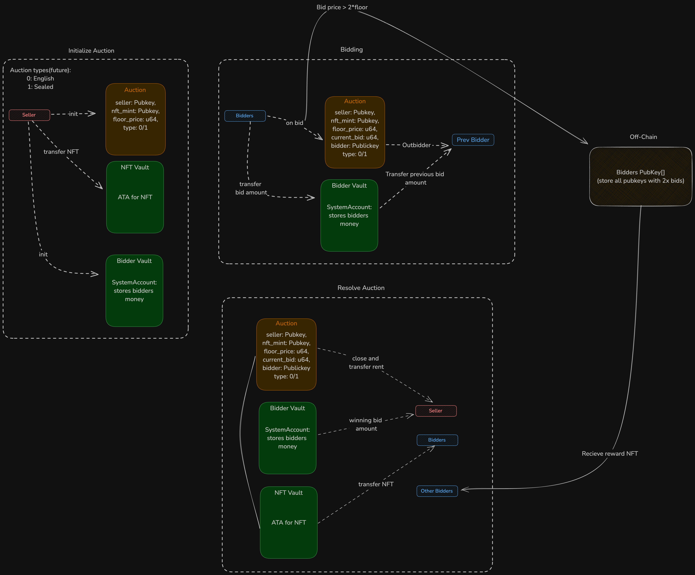

# Outbid
Description: A NFT auction platform that is built on an escrow contract, allowing users to initiate either a open auction—where the highest bid is visible to everyone—or a sealed-bid auction, where the highest bid remains hidden until the auction concludes. Bids that are double the floor price receive a special NFT as a reward for creating a value. Additionally, all auction participants are awarded a POAP (Proof of Attendance Protocol) token at the end of the auction.

## User Stories

### Users: 
1.  Seller
2.  Bidder
    - Sealed-bid auction bidders
    - Open auction bidders

**Seller**
- As a seller, I can start an auction with specific parameters like floor price of the NFT, type of auction(Sealed-bid or Open), and duration so that I can define the terms and conditions for the auction.
- As a seller, starting an auction will automatically create a vault that securely stores the NFT, so that it is protected and ready for transfer to the winning bidder.
- As a seller, if there is no bidder by the end of the auction, I can withdraw the NFT and close the vault so that I get back the ownership of the NFT

**Bidders(for sealed-bid auction)**
- As a bidder, I can bid any price greater than the floor price so that I have a chance to win the NFT without revealing my bid amount to other participants.
- As a bidder, I can be able to view the auction results, so that I know the final bid amount and the winner.
- As a bidder, if I lose the auction, I receive a refund by the end of the auction so that I do not lose my funds for a lost bid
**Bidders(for open auction)**
- As a bidder, I can bid any price greater than the floor price or the latest bid so that I have a chance to win the NFT 
- As a bidder, If any other bidder outbids me, I immediately receive a refund so that I do not lose my funds for a lost bid

**All bidders**
- As a bidder, if I win the auction, I will automatically receive the NFT to my wallet so that I can immediately access it.
- As a bidder, I will receive a POAP by the end of the auction so that my participation is recognised
- As a bidder, if my bid is 2x the original floor price, then I receive a special NFT so that my participation is incentivised